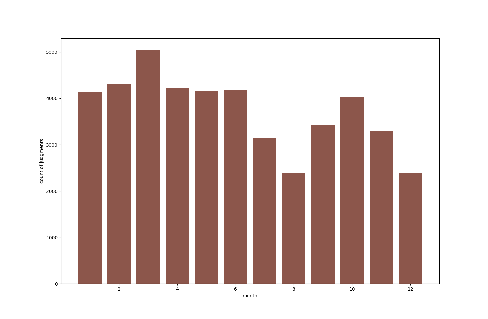

#### 6. Znajdź liczbę orzeczeń, w których występuje słowo szkoda.
```
GET judgments/_search
{
  "query": {
    "match": {
      "content": "szkoda"
    }
  }
}
```
=> 14052

#### 7. Znajdź liczbę orzeczeń, w których występuje fraza trwały uszczerbek na zdrowiu, dokładnie w tej kolejności ale w dowolnej formie fleksyjnej.
```
GET judgments/_search
{
  "query": {
    "match_phrase": {
      "content": "trwały uszczerbek na zdrowiu"
    }
  }
}
```
=> 1124

#### 8. Jak wyżej, ale z uwzględnieniem możliwości wystąpienia maksymalnie 2 dodatkowych słów pomiędzy dowolnymi elementami frazy.
```
GET judgments/_search
{
  "size": 0,
  "query": {
    "match_phrase": {
      "content": {
        "query": "trwały uszczerbek na zdrowiu",
        "slop": 2
      }
    }
  }
}
```
=> 1236

#### 9. Określ 3 sędziów, którzy wydali największą liczbę orzeczeń w danym roku, wraz z liczbą wydanych orzeczeń.

```
GET judgments/_search
{
  "size": 0,
  "aggs": {
    "judges": {
      "terms": {
        "size": 3000,
        "field": "judges",
        "order" : { "_count" : "desc" }
      }
    }
  }
}
```
=>
```
{
  "key": "Radosław Olewczyński",
  "doc_count": 270
},
{
  "key": "Zofia Szcześniewicz",
  "doc_count": 269
},
{
  "key": "Jacek Kępa",
  "doc_count": 264
}
```


#### 10. Przedstaw histogram liczby orzeczeń w zależności od miesiąca.

```
GET judgments/_search
{
  "size": 0,
  "aggs": {
    "histogram": {
      "date_histogram": {
        "interval": "month",
        "field": "date"
      }
    }
  }
}
```

