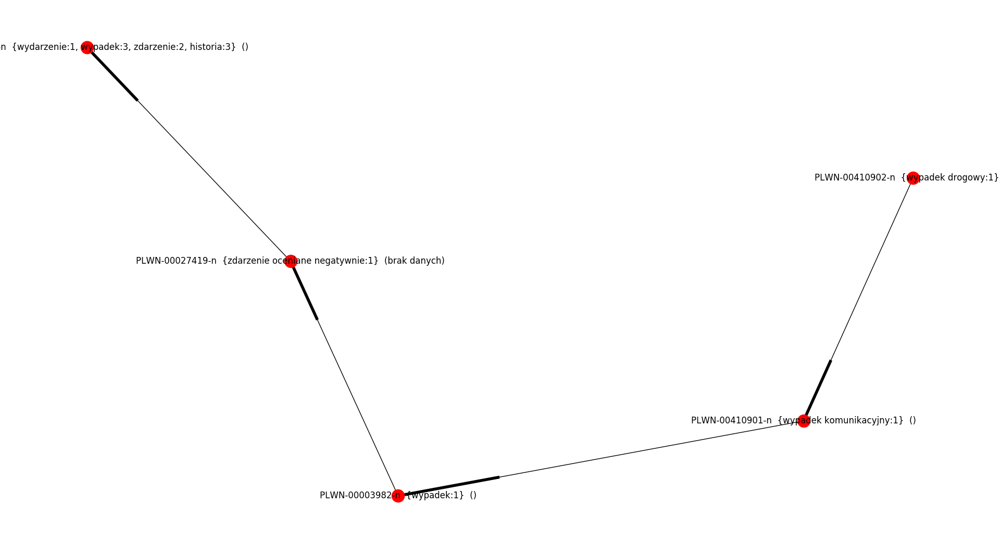
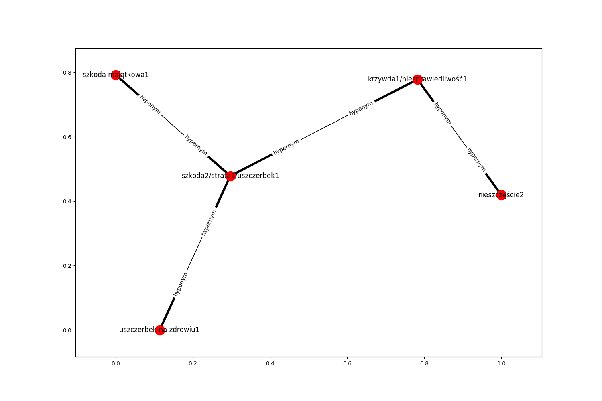
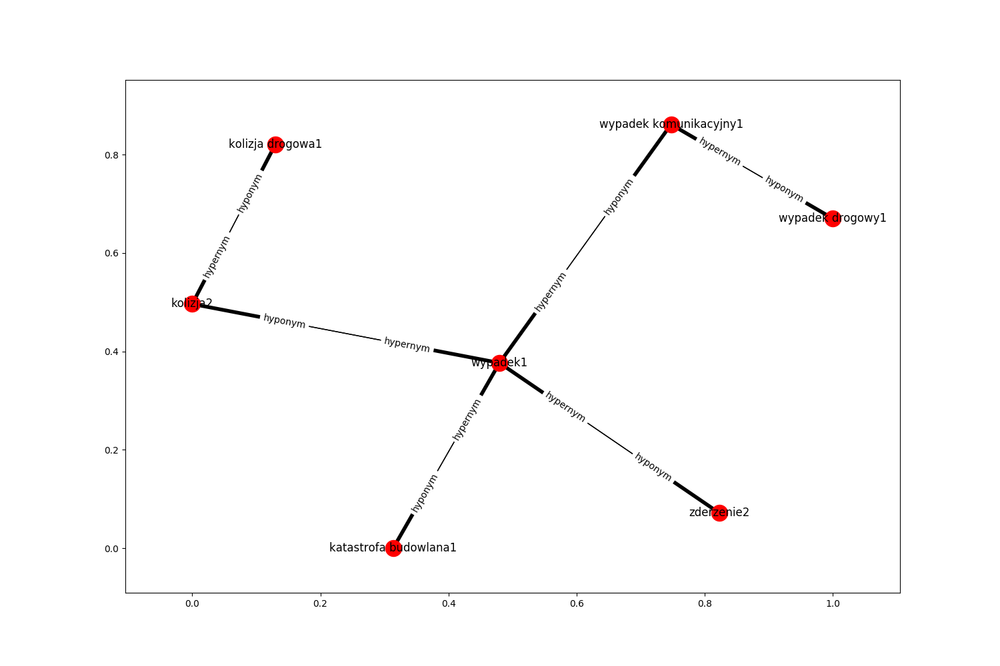

Użyty został poprawiony pywnxml: https://github.com/mat-hek/pywnxml

#3 Znajdź wszystkie znaczenia rzeczownika szkoda oraz wymień ich synonimy (jeśli posiadają).
```python
[x.toString() for x in ex7.szkoda_meanings(q)]
['PLWN-00003675-n  {strata:1, utrata:1, szkoda:2, uszczerbek:1}  ()', 'PLWN-00006533-n  {szkoda:1}  (brak danych)']
```

#4 Znajdź domknięcie przechodnie relacji hiperonimi dla pierwszego znaczenia wyrażenia wypadek drogowy i przedstaw je w postaci grafu skierowanego.
```python
ex7.wypadek_drogowy_hypernym(q)
```


#5 Znajdź bezpośrednie hiponimy rzeczownika wypadek1.
```python
[x.toString() for x in ex7.wypadek_hyponyms(q)]
['PLWN-00001284-n  {zderzenie:2, kraksa:1}  ()', 'PLWN-00006486-n  {kolizja:2}  ()', 'PLWN-00016131-n  {karambol:1}  ()', 'PLWN-00034688-n  {zawał:2}  ()', 'PLWN-00034689-n  {tąpnięcie:1}  ()', 'PLWN-00241026-n  {kapotaż:1}  ()', 'PLWN-00258639-n  {wykolejenie:2}  ()', 'PLWN-00389170-n  {zakrztuszenie:1, zachłyśnięcie:1, aspiracja:3}  ()', 'PLWN-00410901-n  {wypadek komunikacyjny:1}  ()', 'PLWN-00411618-n  {katastrofa budowlana:1}  ()', 'PLWN-00436137-n  {wypadek jądrowy:1}  ()']
```

#6 Znajdź hiponimy drugiego rzędu dla rzeczownika wypadek1.
```python
[x.toString() for x in ex7.wypadek_hyponyms(q, row=2)]
['PLWN-00235346-n  {czołówka:9, zderzenie czołowe:1}  ()', 'PLWN-00471555-n  {stłuczka:1}  ()', 'PLWN-00441365-n  {kolizja drogowa:1}  ()', 'PLWN-00037295-n  {obwał:1}  ()', 'PLWN-00410902-n  {wypadek drogowy:1}  ()']
```


#7 Przedstaw w postaci grafu skierowanego (z etykietami dla krawędzi) relacje semantyczne pomiędzy następującymi grupami leksemów:
- szkoda2, strata1, uszczerbek1, szkoda majątkowa1, uszczerbek na zdrowiu1, krzywda1, niesprawiedliwość1, nieszczęście2.
- wypadek1, wypadek komunikacyjny1, kolizja2, zderzenie2, kolizja drogowa1, bezkolizyjny2, katastrofa budowlana1, wypadek drogowy1.

```python
words1 = "szkoda2n, strata1n, uszczerbek1n, szkoda majątkowa1n, uszczerbek na zdrowiu1n, krzywda1n, niesprawiedliwość1n, nieszczęście2n".split(", ")
ex7.show_relations(q, words1)
```



```python
words2 = "wypadek1n, wypadek komunikacyjny1n, kolizja2n, zderzenie2n, kolizja drogowa1n, katastrofa budowlana1n, wypadek drogowy1n".split(", ")
ex7.show_relations(q, words2)
```



#8 Znajdź wartość miary pokrewieństwa semantycznego Leacocka-Chodorowa ftp://www-vhost.cs.toronto.edu/public_html/public_html/pub/gh/Budanitsky+Hirst-2001.pdf pomiędzy następującymi parami leksemów:
szkoda2 - wypadek1,
kolizja2 - szkoda majątkowa1,
nieszczęście2 - katastrofa budowlana1.

```python
ex7.leacock_chodorow(q, "szkoda2", "wypadek1")
1.2430380486862944
ex7.leacock_chodorow(q, "kolizja2", "szkoda majątkowa1")
1.0669467896306133
ex7.leacock_chodorow(q, "nieszczęście2", "katastrofa budowlana1")
0.890855530574932
```
