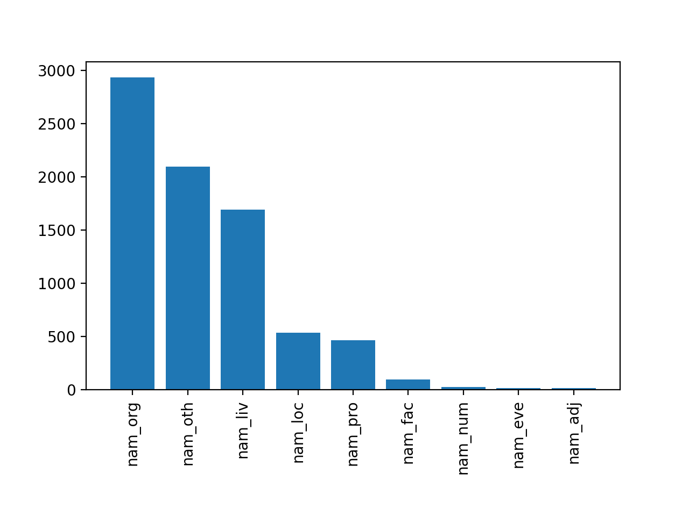

#6 Przedstaw liczność rozpoznanych klas w postaci dwóch wykresów:
  - na pierwszy wykresie przedstaw drobnoziarnistą klasyfikację wyrażeń, tzn. uwzględniając klasy takie jak nam_fac_bridge, nam_liv_animal, nam_loc_gpe, itd.,

  

  - na drugim wykresie przedstaw zgrubną klasyfikację wyrażeń. tzn. uwzględniając klasy takie jak nam_adj, nam_eve, nam_fac, nam_liv, itd.

  

#7 Przedstaw 100 najczęściej rozpoznanych wyrażeń, wraz z podaniem liczby ich wystąpień oraz kategorii semantycznej (tzn. niskopoziomowej (drobnoziarnistej) klasy przypisanej przez NER).

Wyrażenia z przypisaną więcej niż jedną kategorią w pliku `most_frequent_ner_phrases.exs`

```elixir
[
  {"M . N", 202, ["nam_liv_person"]},
  {"Sąd Rejonowy", 198, ["nam_org_institution"]},
  {"Sąd Okręgowy", 191, ["nam_org_institution"]},
  {"Dz . U .", 169, ["nam_pro_media_periodic"]},
  {"Sądu Najwyższego", 138, ["nam_org_institution"]},
  {"Sądu Rejonowego", 104, ["nam_org_institution"]},
  {"Skarbu Państwa", 95, ["nam_org_institution"]},
  {"Skarb Państwa", 80, ["nam_org_institution"]},
  {"Sądu Okręgowego", 69, ["nam_org_institution"]},
  {"Sąd Najwyższy", 52, ["nam_org_institution"]},
  {"A . L", 44, ["nam_liv_person"]},
  {"Funduszu Ubezpieczeń Społecznych", 41, ["nam_org_institution"]},
  {"L . J", 40, ["nam_liv_person"]},
  {"Sąd Apelacyjny", 37, ["nam_org_institution"]},
  {"P . L", 37, ["nam_liv_person"]},
  {"Ministra Sprawiedliwości", 36, ["nam_org_institution"]},
  {"M . B", 30, ["nam_liv_person"]},
  {"Sądu Apelacyjnego", 27, ["nam_org_institution"]},
  {"M . G", 26, ["nam_liv_person"]},
  {"IMIENIU RZECZYPOSPOLITEJ POLSKIEJ Dnia", 26, ["nam_org_institution"]},
  {"J . K", 26, ["nam_liv_person"]},
  {"Sąd I instancji", 23, ["nam_org_institution"]},
  {"Prezesa Krajowej Izby Odwoławczej", 22, ["nam_org_institution"]},
  {"Sąd I", 22, ["nam_org_institution"]},
  {"Portalu Aukcji Publicznych", 22, ["nam_org_institution"]},
  {"J . M", 20, ["nam_liv_person"]},
  {"Zakład Ubezpieczeń Społecznych I Oddział w Ł", 20,
   ["nam_org_institution"]},
  {"S . K", 20, ["nam_liv_person"]},
  {"Z . L", 20, ["nam_liv_person"]},
  {"B . B", 18, ["nam_liv_person"]},
  {"Sąd Okręgowy w Łodzi", 18, ["nam_org_institution"]},
  {"S . C", 18, ["nam_liv_person"]},
  {"Krajowa Izba Odwoławcza", 18, ["nam_org_institution"]},
  {"M . K", 17, ["nam_liv_person"]},
  {"Prawo zamówień publicznych", 17, ["nam_pro_title_document"]},
  {"IMIENIU RZECZYPOSPOLITEJ POLSKIEJ", 15, ["nam_org_institution"]},
  {"Sądu Okręgowego w Gdańsku", 15, ["nam_org_institution"]},
  {"bazowej", 15, ["nam_oth_currency"]},
  {"Sądu Okręgowego w Łodzi", 14, ["nam_org_institution"]},
  {"Zakładu Medycyny Sądowej UM w P", 13, ["nam_org_institution"]},
  {"Sądu Apelacyjnego w Łodzi", 13, ["nam_org_institution"]},
  {"M . L", 13, ["nam_liv_person"]},
  {"obwinionego", 12, ["nam_org_institution"]},
  {"wyjaśnieniami", 12, ["nam_oth_tech"]},
  {"2906", 12, ["nam_oth_currency"]},
  {"informacyjnymi", 12, ["nam_oth_tech"]},
  {"Sąd odwoławczy", 12, ["nam_org_institution"]},
  {"B . M", 11, ["nam_liv_person"]},
  {"Sądu Apelacyjnego w Gdańsku", 11, ["nam_org_institution"]},
  {"Kapitał", 11, ["nam_oth_currency"]},
  {"Sądzie Rejonowym", 11, ["nam_org_institution"]},
  {"Sądu Rejonowego dla Łodzi", 10, ["nam_org_institution"]},
  {"M . D", 10, ["nam_liv_person"]},
  {"Sąd Rejonowy dla Łodzi", 10, ["nam_org_institution"]},
  {"M . J", 10, ["nam_liv_person"]},
  {"Sąd Apelacyjny w Gdańsku", 10, ["nam_org_institution"]},
  {"pomnożenie", 10, ["nam_oth_currency"]},
  {"Sąd Okręgowy w Gdańsku", 10, ["nam_org_institution"]},
  {"Trybunału Konstytucyjnego", 9, ["nam_org_institution"]},
  {"Starostwa Powiatowego", 9, ["nam_org_institution"]},
  {"Zakład Ubezpieczeń Społecznych Oddział", 9, ["nam_org_company"]},
  {"oparł", 9, ["nam_org_institution"]},
  {"M . P", 9, ["nam_liv_person"]},
  {"Prezydenta Miasta G", 9, ["nam_org_institution"]},
  {"ustawy z dnia 17 grudnia 1998 r . o emeryturach", 8,
   ["nam_pro_title_document"]},
  {"S . B", 8, ["nam_liv_person"]},
  {"L . B", 8, ["nam_liv_person"]},
  {"ustawy o emeryturach", 8, ["nam_pro_title_document"]},
  {"B . K", 8, ["nam_liv_person"]},
  {"oni", 8, ["nam_liv_person"]},
  {"D . S", 8, ["nam_liv_person"]},
  {"A . M", 8, ["nam_liv_person"]},
  {"Wydział Cywilny", 8, ["nam_org_institution"]},
  {"Bloku Operacyjnego", 8, ["nam_org_institution"]},
  {"D . M", 8, ["nam_liv_person"]},
  {"Sądowi Rejonowemu", 8, ["nam_org_institution"]},
  {"równej", 8, ["nam_oth_currency"]},
  {"2115", 8, ["nam_oth_currency"]},
  {"M . M", 8, ["nam_liv_person"]},
  {"Kodeksu cywilnego", 7, ["nam_pro_title_document"]},
  {"uchylił", 7, ["nam_org_institution"]},
  {"ZMS", 7, ["nam_org_organization"]},
  {"SKA", 7, ["nam_org_institution"]},
  {"PK", 7, ["nam_org_institution"]},
  {"COIG S . A .", 7, ["nam_org_company"]},
  {"odmiennego", 7, ["nam_org_institution"]},
  {"S . Z", 7, ["nam_liv_person"]},
  {"Prezesa Rady Ministrów", 7, ["nam_org_institution"]},
  {"Zakładu Ubezpieczeń Społecznych", 7, ["nam_org_institution"]},
  {"Bank S . A .", 7, ["nam_org_company"]},
  {"Zakładach", 7, ["nam_loc_gpe_city"]},
  {"niepubl", 7, ["nam_org_institution"]},
  {"Urzędu Zamówień Publicznych", 7, ["nam_org_institution"]},
  {"Rolniczej Spółdzielni Produkcyjnej Zjednoczenie", 7,
   ["nam_org_institution"]},
  {"Dz . U z", 7, ["nam_pro_media_periodic"]},
  {"przedmiotowa", 6, ["nam_org_institution"]},
  {"gruntowej", 6, ["nam_org_institution"]},
  {"J . J", 6, ["nam_liv_person"]},
  {"wynosiły", 6, ["nam_oth_currency"]},
  {"Sądu Apelacyjnego w Białymstoku", 6, ["nam_org_institution"]}
]
```

#8 Przedstaw 10 najczęstszych wyrażeń, dla każdej wysokopoziomowej (zgrubnej) klasy wyrażeń.

```elixir
[
  {"nam_adj",
   [
     {"baczność", 5, ["nam_adj_country"]},
     {"rosyjscy", 4, ["nam_adj_country"]},
     {"rozmawiali", 4, ["nam_adj_country"]},
     {"żołnierze", 4, ["nam_adj_country"]},
     {"żołnierzu", 3, ["nam_adj_country"]},
     {"walutę", 2, ["nam_adj_country"]},
     {"Baczność", 1, ["nam_adj_country"]},
     {"denominowany", 1, ["nam_adj_country"]},
     {"dostępności", 1, ["nam_adj_city"]},
     {"europejski", 1, ["nam_adj_other"]}
   ]},
  {"nam_eve",
   [
     {"Przedsiębiorstwie Usług", 3, ["nam_eve_human_sport"]},
     {"888", 1, ["nam_eve_human"]},
     {"Przedkładała", 1, ["nam_eve_human_sport"]},
     {"Zakresu znamienia czynnościowego", 1, ["nam_eve_human"]},
     {"Zolla", 1, ["nam_eve_human"]},
     {"darowuje", 1, ["nam_eve_human"]},
     {"ograniczać", 1, ["nam_eve_human"]},
     {"podsumowując", 1, ["nam_eve_human"]}
   ]},
  {"nam_fac",
   [
     {"hospitalizowany", 2, ["nam_fac_goe"]},
     {"Firma Handlowo Usługowa", 2, ["nam_fac_goe"]},
     {"Mazowieckiego Szpitala Bródnowskiego", 2, ["nam_fac_goe"]},
     {"Burmistrza Gminy M", 2, ["nam_fac_goe"]},
     {"Kancelarii Notarialnej B . M", 2, ["nam_fac_goe"]},
     {"Gminna Spółdzielnia", 2, ["nam_fac_goe"]},
     {"Wojewódzkim Szpitalu dla Nerwowo", 2, ["nam_fac_goe"]},
     {"wychowawczy", 2, ["nam_fac_goe"]},
     {"Wojewódzkim Szpitalu", 1, ["nam_fac_goe"]},
     {"dopraszania", 1, ["nam_fac_goe"]}
   ]},
  {"nam_liv",
   [
     {"M . N", 202, ["nam_liv_person"]},
     {"A . L", 44, ["nam_liv_person"]},
     {"L . J", 40, ["nam_liv_person"]},
     {"P . L", 37, ["nam_liv_person"]},
     {"M . B", 30, ["nam_liv_person"]},
     {"M . G", 26, ["nam_liv_person"]},
     {"J . K", 26, ["nam_liv_person"]},
     {"J . M", 20, ["nam_liv_person"]},
     {"S . K", 20, ["nam_liv_person"]},
     {"Z . L", 20, ["nam_liv_person"]}
   ]},
  {"nam_loc",
   [
     {"Zakładach", 7, ["nam_loc_gpe_city"]},
     {"Gorzowie Wielkopolskim", 6, ["nam_loc_gpe_city"]},
     {"Stare Miasto", 4, ["nam_loc_gpe_city"]},
     {"klinice", 3, ["nam_loc_gpe_country"]},
     {"wsi", 3, ["nam_loc_gpe_city"]},
     {"Nowym Tomyślu", 3, ["nam_loc_gpe_city"]},
     {"Rzeczypospolitej Polskiej", 3, ["nam_loc_gpe_country"]},
     {"Bar", 3, ["nam_loc_gpe_city"]},
     {"gminie", 2, ["nam_loc_gpe_admin3"]},
     {"witaminy", 2, ["nam_loc_gpe_country"]}
   ]},
  {"nam_num",
   [{"rozliczył", 1, ["nam_num_phone"]}, {"Życie", 1, ["nam_num_phone"]}]},
  {"nam_org",
   [
     {"Sąd Rejonowy", 198, ["nam_org_institution"]},
     {"Sąd Okręgowy", 191, ["nam_org_institution"]},
     {"Sądu Najwyższego", 138, ["nam_org_institution"]},
     {"Sądu Rejonowego", 104, ["nam_org_institution"]},
     {"Skarbu Państwa", 95, ["nam_org_institution"]},
     {"Skarb Państwa", 80, ["nam_org_institution"]},
     {"Sądu Okręgowego", 69, ["nam_org_institution"]},
     {"Sąd Najwyższy", 52, ["nam_org_institution"]},
     {"Funduszu Ubezpieczeń Społecznych", 41, ["nam_org_institution"]},
     {"Sąd Apelacyjny", 37, ["nam_org_institution"]}
   ]},
  {"nam_oth",
   [
     {"bazowej", 15, ["nam_oth_currency"]},
     {"wyjaśnieniami", 12, ["nam_oth_tech"]},
     {"2906", 12, ["nam_oth_currency"]},
     {"informacyjnymi", 12, ["nam_oth_tech"]},
     {"Kapitał", 11, ["nam_oth_currency"]},
     {"pomnożenie", 10, ["nam_oth_currency"]},
     {"równej", 8, ["nam_oth_currency"]},
     {"2115", 8, ["nam_oth_currency"]},
     {"wynosiły", 6, ["nam_oth_currency"]},
     {"384", 6, ["nam_oth_currency"]}
   ]},
  {"nam_pro",
   [
     {"Dz . U .", 169, ["nam_pro_media_periodic"]},
     {"Prawo zamówień publicznych", 17, ["nam_pro_title_document"]},
     {"ustawy z dnia 17 grudnia 1998 r . o emeryturach", 8,
      ["nam_pro_title_document"]},
     {"ustawy o emeryturach", 8, ["nam_pro_title_document"]},
     {"Kodeksu cywilnego", 7, ["nam_pro_title_document"]},
     {"Dz . U z", 7, ["nam_pro_media_periodic"]},
     {"ustawy z dnia 17 grudnia 1998 roku o emeryturach", 6,
      ["nam_pro_title_document"]},
     {"Konstytucji RP", 6, ["nam_pro_title_document"]},
     {"ustawy z dnia 13 października 1998 r . o systemie ubezpieczeń społecznych",
      5, ["nam_pro_title_document"]},
     {"rozporządzenia Rady Ministrów", 5, ["nam_pro_title_document"]}
   ]}
]
```
