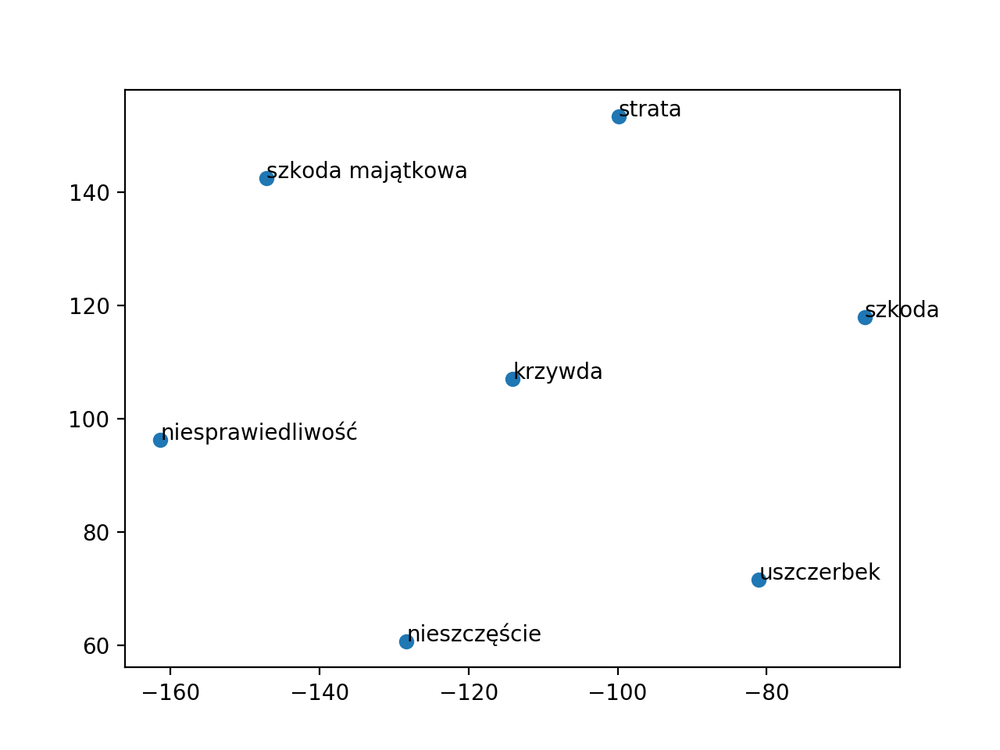

#7 Znajdź 3 najbardziej podobne wyrażenia (słowa i zwroty) dla następujących wyrażeń:

```python
exprs = ["Sąd Najwyższy", "Trybunał Konstytucyjny", "kodeks cywilny", "kpk", "sąd rejonowy", "szkoda", "wypadek", "kolizja", "szkoda majątkowa", "nieszczęście", "rozwód"]
[(e, ex9.most_similar(e, wv)) for e in exprs]

[('Sąd Najwyższy',
  [('SN', 0.7430596351623535),
   ('Trybunał_Konstytucyjny', 0.7165009379386902),
   ('Sad_Najwyższy', 0.6911699771881104)]),
 ('Trybunał Konstytucyjny',
  [('Trybunał', 0.8431119322776794),
   ('Sąd_Najwyższy', 0.7165009379386902),
   ('Trybunał_Sprawiedliwości', 0.711972177028656)]),
 ('kodeks cywilny',
  [('Kodeks_cywilny', 0.7438700199127197),
   ('kodeks_karny', 0.6964765191078186),
   ('Ustawa_ta', 0.6466259956359863)]),
 ('kpk',
  [('kpw', 0.7376797199249268),
   ('KPK', 0.7274689674377441),
   ('kks', 0.6831251978874207)]),
 ('sąd rejonowy',
  [('sąd_meriti', 0.9029613733291626),
   ('sąd_okręgowy', 0.8498207330703735),
   ('Sąd_Rejonowy', 0.8058401942253113)]),
 ('szkoda',
  [('szkoda_majątkowa', 0.7630425691604614),
   ('Szkoda', 0.7541429996490479),
   ('krzywda', 0.681978166103363)]),
 ('wypadek',
  [('przypadek', 0.48933714628219604),
   ('Wypadek', 0.4830167293548584),
   ('wskutek_wypadku', 0.4820813536643982)]),
 ('kolizja',
  [('kolizja_drogowa', 0.6691293120384216),
   ('usterka', 0.6614017486572266),
   ('awaria', 0.6320029497146606)]),
 ('szkoda majątkowa',
  [('szkoda', 0.7630426287651062),
   ('Szkoda', 0.7058690786361694),
   ('krzywda', 0.6954615116119385)]),
 ('nieszczęście',
  [('spotkanie_informacyjne', 0.6681182384490967),
   ('Stłumione', 0.6459775567054749),
   ('zoperowane', 0.6438241004943848)]),
 ('rozwód',
  [('rozwiązanie_małżeństwa', 0.6711518168449402),
   ('orzeczenie_rozwodu', 0.6509937644004822),
   ('eksmisję', 0.6272086501121521)])]
```

#8 Znajdź wypadkową operacji na słowach (5 najbliższych wyników)

```python
exprs = ["Sąd Najwyższy - kpc + konstytucja", "pasażer - mężczyzna + kobieta", "samochód - droga + rzeka"]
[(e, ex9.rem_add(x, rem, add, wv)) for (e, [x, rem, add]) in [(e, re.split(r" \+ | \- ", e)) for e in exprs]]

[('Sąd Najwyższy - kpc + konstytucja',
  [('Sąd_Najwyższy', 0.8905000686645508),
   ('SN', 0.7035828828811646),
   ('Trybunał_Konstytucyjny', 0.5877265930175781),
   ('Sad_Najwyższy', 0.5765100717544556),
   ('Sądu_Najwyższego', 0.5717679262161255)]),
 ('pasażer - mężczyzna + kobieta',
  [('kobieta', 0.47905290126800537),
   ('Poszkodowana', 0.47521182894706726),
   ('pracownica', 0.4505569636821747),
   ('placówka', 0.44748955965042114),
   ('ekipa', 0.4453071355819702)]),
 ('samochód - droga + rzeka',
  [('samochód', 0.7121870517730713),
   ('pojazd', 0.6171031594276428),
   ('ciągnik', 0.5481181740760803),
   ('towar', 0.5356907844543457),
   ('Pojazd', 0.5284040570259094)])]
```

#9 Korzystając z algorytmu t-SNE przedstaw projekcję wektorów następujących słów na płaszczyznę:
```python
exprs = ["szkoda", "strata", "uszczerbek", "szkoda majątkowa",
 "krzywda", "niesprawiedliwość", "nieszczęście"]
ex9.surface_proj(exprs, wv)
```


